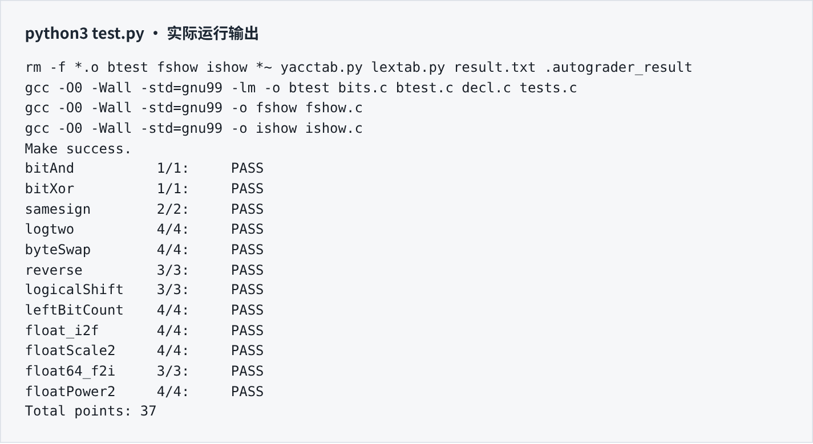

# DataLab 实验报告

姓名：张天杨　　学号：2025201726

## 测试结果

原始 `python3 test.py` 得分 **37 / 37**，12 个函数的正确性与合规性检查全部通过。分值及操作符数量按 `test.py -V` 的实际输出记录。

| 函数 | 得分 | 操作符数 / 上限 |
| :--- | :---: | :---: |
| `bitAnd` | 1 / 1 | 4 / 7 |
| `bitXor` | 1 / 1 | 7 / 7 |
| `samesign` | 2 / 2 | 6 / 12 |
| `logtwo` | 4 / 4 | 17 / 25 |
| `byteSwap` | 4 / 4 | 12 / 17 |
| `reverse` | 3 / 3 | 23 / 30 |
| `logicalShift` | 3 / 3 | 9 / 20 |
| `leftBitCount` | 4 / 4 | 31 / 50 |
| `float_i2f` | 4 / 4 | 19 / 30 |
| `floatScale2` | 4 / 4 | 14 / 30 |
| `float64_f2i` | 3 / 3 | 18 / 60 |
| `floatPower2` | 4 / 4 | 9 / 30 |

测试环境：Linux x86_64，Debian 13，GCC 14.2.0，Python 3.13.5；原始构建参数为 `-O0 -Wall -std=gnu99`。完整编译无警告。源码修改限于 `bits.c`，未修改评分脚本、参考函数和构建配置。

## 解题报告：整数与位运算

### 亮点

`float_i2f` 用保留位与舍弃位处理最近偶数舍入，并统一处理尾数进位；`logicalShift` 对零位移单独构造掩码，避免移位 32 位；`reverse` 用五层分组交换完成反转。

### 1. bitAnd

由德摩根律，`x & y` 等价于 `~(~x | ~y)`。对每一位而言，只有两个输入都是 1 时，结果才是 1；共使用 4 个允许的操作符。

### 2. bitXor

使用 `~(x & y) & ~(~x & ~y)`。第一项排除“两位都为 1”，第二项排除“两位都为 0”，剩下的恰好是两位不同的情况，共 7 次操作。

### 3. samesign

先处理零：`x` 为零时返回 `!y`，只有两个输入均为零才同号；`x` 非零而 `y` 为零时返回 0。其余输入通过 `(x ^ y) >> 31` 判断符号位是否不同，再取逻辑非得到 0 或 1。

### 4. logtwo

答案是最高有效 1 的下标，即向下取整的二进制对数。依次检查数值是否超过 `0xFFFF`、`0xFF`、`0xF`、`3`、`1`，产生 16、8、4、2、1 的位移量；每轮缩小剩余数值，并将位移量按位或入结果。各位移量占据不同二进制位，因此这里的按位或等价于相加，无需循环和分支。

### 5. byteSwap

令 `ns = n << 3`、`ms = m << 3`，提取两个字节的差异 `delta = ((x >> ns) ^ (x >> ms)) & 0xFF`。把同一个差异分别移回两个位置，再与原值异或，即可交换这两个字节，其余位不变。当 `n == m` 时差异为零，原值保持不变。

左移前使用 `0xFFu` 掩码，使移位表达式采用无符号运算，避免置入第 31 位时发生有符号左移问题；局部变量仍均为 `int`。返回值按本实验 GCC 环境的 32 位补码转换规则解释。[2]

### 6. reverse

分别交换相邻的 1、2、4、8、16 位分组。前四轮使用 `0x55555555`、`0x33333333`、`0x0F0F0F0F`、`0x00FF00FF` 隔离分组，最后交换高低 16 位。每轮只改变组的位置，不丢失位，五轮后每一位的位置从 `i` 变为 `31-i`。

### 7. logicalShift

先算术右移，再与保留低 `32-n` 位的掩码相与。当 `n>0` 时，`0x7FFFFFFF >> ((n+31)&31)` 给出该掩码；当 `n==0` 时，`isZero = !n` 对应的 `~isZero+1` 为全 1，保留原值。所有实际位移量均在 0～31 内。

### 8. leftBitCount

连续前导 1 的数量等于 `~x` 的前导 0 数量。对 `v = ~x` 用 16、8、4、2、1 五轮右移定位最高非零位 `highest`。正数情形的答案为 `31-highest`，在 0～31 范围内可写作 `31 ^ highest`。`v` 为负时五轮均置位，得到 31，答案为 0；`v==0` 对应原值全 1，额外加 1 得到 32。

## 解题报告：浮点数位表示

### 9. float_i2f

先处理 0，并分离符号与绝对值。负数先把非负的 `~x` 赋给无符号变量，再加 1，因此 `INT_MIN` 不需要执行会溢出的有符号取负。不断左移绝对值，直到最高位为 1，同时递减指数。

归一化后，高 24 位是包含隐藏位的有效数，低 8 位是舍弃部分。低 8 位大于 `0x80` 时向上舍入，小于它时不进位；恰好等于它时，只有保留部分最低位为 1 才加 1，实现最近偶数舍入。最终用 `((exponent-1)<<23) + significand` 组合：隐藏位补回减去的指数单位，舍入导致的额外进位也自然进入指数。[1]

边界例子：`16777217` 恰好处于两个可表示数的中间，舍入到 `16777216`；`16777219` 舍入到 `16777220`。`INT_MIN` 的结果为 `0xCF000000`。

### 10. floatScale2

拆分符号、指数和尾数。指数为 255 时原样返回，保留无穷大与 NaN 的位模式；指数为 0 时尾数左移一位，能够直接覆盖零、非规格化数，以及跨入规格化区间的情况。其余数将指数加 1；若增加后成为 255，则清空尾数并返回同符号无穷大，避免错误地产生 NaN。[1]

### 11. float64_f2i

从高 32 位提取符号与指数，令真实指数 `E = exponent-1023`。`E<0` 时绝对值小于 1，向零截断为 0；`E>30` 时返回 `0x80000000`。其中精确的 `-2^31` 本来就等于该位模式，其余相关越界值使用相同的溢出标记。

对 `0<=E<=30`，高字包含隐藏位与尾数高 20 位。当 `E<=20` 时，将该有效数右移 `20-E` 位；否则将其左移 `E-20` 位，再拼接低字右移 `52-E` 位的结果。舍弃的小数部分不参与舍入，最后按符号恢复正负。此时绝对值不超过 `INT_MAX`，转换与取负均安全。低字位移只可能为 22～31，不会移位 32 位。

### 12. floatPower2

按照单精度能表示的指数范围直接构造位模式：[1]

| 输入范围 | 返回位模式 |
| :--- | :--- |
| `x < -149` | 0 |
| `-149 <= x < -126` | `1u << (x+149)`，非规格化数 |
| `-126 <= x <= 127` | `(x+127) << 23`，规格化数 |
| `x > 127` | `0x7F800000`，正无穷大 |

## 补充检查

独立对照程序覆盖 200,000 组固定种子的随机字对及定向边界，共 11,881,164 次比较。每个字检查全部 16 种字节交换与 32 种右移量，另检查浮点舍入、NaN、无穷大及整数转换边界。GCC `-O2`、Clang 17 `-O2` 和 GCC 未定义行为检测三个配置均通过，严格警告构建亦通过。该检查不等同于全输入穷举，原始评测结果仍以上页为准。

## 参考的重要资料

[1] Oracle, *Numerical Computation Guide: IEEE Arithmetic*（格式与舍入规则）：<https://docs.oracle.com/cd/E19059-01/stud.10/819-0499/ncg_math.html>。

[2] GCC, *Integers implementation*（整数转换与右移语义）：<https://gcc.gnu.org/onlinedocs/gcc/Integers-implementation.html>。
